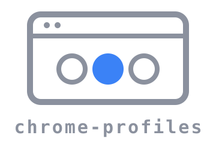
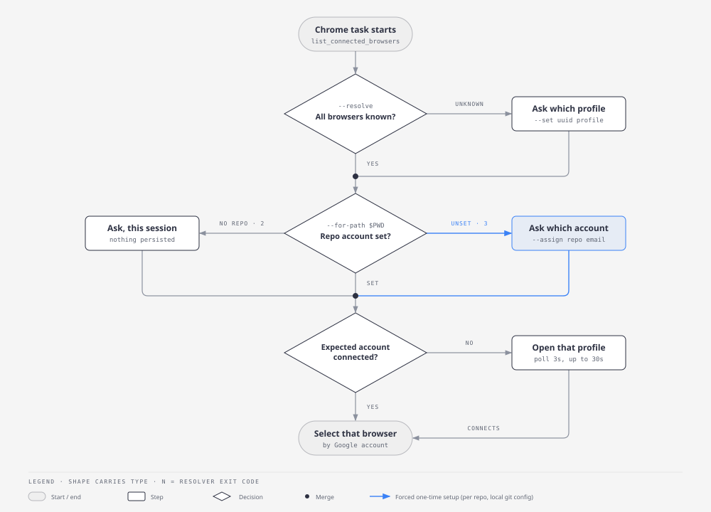

<div align="center">



**The right Chrome, every time. Claude in Chrome for people with more than one Google account.**

Identify browsers by the account signed into them, and let every repo declare the account it expects.

[](https://github.com/scaccogatto/claude-chrome-profiles/actions/workflows/ci.yml)
[](LICENSE)
[](https://code.claude.com/docs/en/plugins)

```shell
/plugin marketplace add scaccogatto/claude-chrome-profiles
/plugin install chrome-profiles@claude-chrome-profiles
```

</div>

---

Run Claude in Chrome on a work profile, a personal one and a client one, and every
browser shows up as the same extension with a random deviceId. Profile labels do not
help: they are local, editable, and often identical ("Person 1", your first name twice).
So the agent guesses, and logs into the client's dashboard with your personal account.

**chrome-profiles** removes the guess:

- **Identity is the Google account.** Each connected browser is resolved to the account
  signed into its Chrome profile, read straight from Chrome's own storage.
- **Each repo declares its account.** Once, on first use, stored in the repo's local git
  config. Every worktree inherits it; nothing is committed.
- **Unknown means ask.** An unmapped browser or an unconfigured repo is a question for
  you, never a silent pick.
- **The right profile, opened for you.** If the expected account is not connected, the
  agent offers to launch Chrome on that profile and waits for it to connect.

## How it works

<p align="center">
  
</p>

The plugin ships one skill, `chrome-profiles`, that loads only when a Chrome task
starts, and one resolver script it drives. Nothing sits in your context the rest of
the time.

## Per-repo account

The expected account lives in the repo's **local** git config:

```shell
git config --local chrome-profiles.account you@company.com
```

You rarely type this: the first time Claude uses Chrome in a repo with no account set,
the skill lists your accounts, asks which one, and records it with `--assign`.

Why git config and not a dotfile like `.nvmrc`: the account is personal. A committed
file would publish your email and be wrong for every teammate; an ignored file would
not follow you into new worktrees. Local git config is per user, never committed, and
shared by all worktrees of the repo.

Outside a git repo, the skill asks which account to use for that session and persists
nothing.

## The resolver

`skills/chrome-profiles/scripts/chrome-browser-map.py`: stdlib-only Python 3, no
dependencies. Output is tab-separated:
`deviceId  profile-dir  name  email  gaia-id  source`.

| Mode | Does | Exit codes |
|---|---|---|
| *(none)* | List every profile with the extension installed | 0 |
| `--resolve UUID...` | Resolve deviceIds; `UNKNOWN` plus `CANDIDATE` rows for the rest | 0 all known, 1 some unknown |
| `--for-path DIR` | Account the repo at DIR expects | 0, 1 no profile has it, 2 not a repo, 3 `UNSET` |
| `--assign DIR EMAIL` | Set the repo's account (must be signed into a profile) | 0, 2 rejected |
| `--set UUID PROFILE_DIR` | Record which profile a deviceId belongs to | 0, 2 rejected |
| `--device UUID` | Account email of one deviceId | 0, 1 unknown |
| `--forget UUID` | Drop a cache entry | 0 |
| `--self-check` | Offline self-test on a synthetic Chrome tree | 0 `ok`, 1 failure |

### Read-only toward Chrome

The resolver **never writes to Chrome**. It reads `Local State` for the profile
accounts and scans the extension's LevelDB files for the deviceId written at pairing,
without taking locks, so it works while Chrome is running. The only files it writes
are its own deviceId cache and, on `--assign`, the repo's local git config.

| Environment variable | Default |
|---|---|
| `CHROME_ROOT` | `~/Library/Application Support/Google/Chrome` |
| `CHROME_MAP_CACHE` | `~/.claude/chrome-devices.json` |

## Requirements

- macOS with Google Chrome and the [Claude in Chrome](https://claude.com/chrome) extension
- Python 3 and git on `PATH`

## Development

```shell
make test       # resolver self-check: synthetic Chrome tree, throwaway git repos
make validate   # manifest JSON + claude plugin validate
```

Releases are cut by CI: bump `version` in `.claude-plugin/plugin.json` on `main` and
the release workflow tags `v<version>` and publishes the release.

## License

[MIT](LICENSE)
